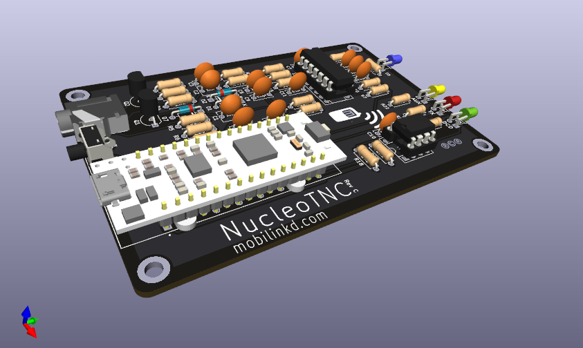

# NucleoTNC KiCAD Files

This repository contains the KiCAD files for the NucleoTNC PCB, the spacer
needed to mount the Nucleo32 board at the proper height for the enclosure,
and the two enclosure encaps.

This is project is Open Source Hardware.

These files are licensed under the CERN Open Hardware Licence version 2
(CERN-OHL-S). Please see the [LICENSE](LICENSE) file for details. Note that
this license only covers the hardware in this repository. The firmware for
the NucleoTNC is licensed separately under the GPLv3.

These files are currently for KiCAD version 7.

# NucleoTNC PCB and Spacer

The NucleoTNC is a breadboard TNC project that reproduced most of the
features of the Mobilinkd TNC3. I just lacked a battery and Bluetooth
support. It was and remains a very popular project build for ham radio
operators.

This PCB was designed to allow experimenters that wanted a more permanent
home for their TNC to move the components onto a PCB. The PCB is designed
with a special pin pattern that will securely hold the ST Microelectronics
Nucleo32 board without a socket or soldering.

The spacer is designed to hold the Nucleo32 module off of the PCB at the
correct height to fit in the enclosure. It can either be made as a PCB out
of FR-4 material or 3D-printed using any non-conductive material.

# NucleoTNC Front and Back Panel

The front and back panels are designed for use with the Szomk AK-C-C15 100mm
aluminum enclosure. This will require 8 M2.5 screws. We use stainless steel
socket-cap screws for this.

# Kits For Sale

The PCB and spacer, and the complete enclosure can be purchased online
from Mobilinkd. https://store.mobilinkd.com/collections/kits
